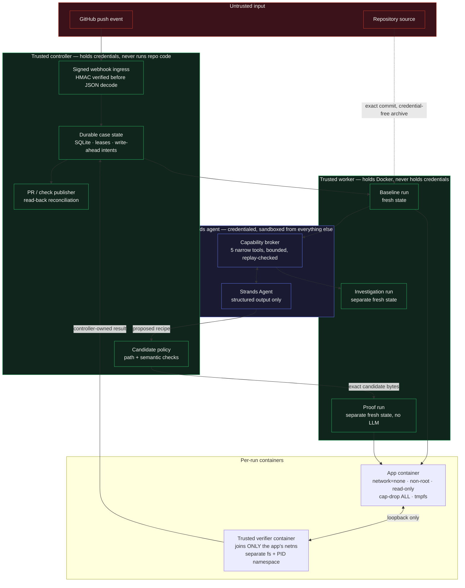

# FirstRun

**Keep the "getting started" instructions in your README actually working — and prove it.**

Built with [Strands Agents](https://strandsagents.com/) for the Agents for Humans Hackathon.
Track: **Professional Agents**.

---

## The problem

Every repository has a setup section. `npm install`, run the migrations, start the
server. It worked the day someone wrote it.

Then a migration step gets added to the code but not the README. A script is renamed.
A dependency starts needing an extra command. Nothing in CI notices, because CI runs
on a warm machine with a populated cache and a database that already has its tables.

The person who finds out is the newcomer on their first day, at the exact moment they
have the least context and the least patience. The maintainer finds out later, in an
issue titled "setup doesn't work", if the newcomer bothers to file one.

This is a small problem that happens constantly, to almost every project, and nobody
owns it.

## Who it's for

Maintainers, indie developers, and small teams who care whether a new contributor can
actually get their project running.

## What FirstRun does

FirstRun continuously tests the declared setup path from a genuinely clean state. When
it breaks, a Strands agent investigates the real failure, proposes a bounded repair to
the setup instructions, and the repair is then **independently re-verified from scratch**
before anything is published as a pull request.

It never auto-merges. It never claims something works because a model said so.

---

## The idea that makes it work

Three artifacts, with different authority:

| Artifact | Question | Who may change it |
|---|---|---|
| `.firstrun/target.json` | **What** must succeed | Humans only. Frozen for a case. |
| `.firstrun/recipe.json` | **How** to get there | Repairable by the agent, under policy |
| README managed block | What newcomers are told | Rendered deterministically from the recipe |

The recipe is the executable source of truth. The README block is generated from it, and
a pre-execution check rejects any divergence — so the documentation cannot drift away
from the commands that are actually tested.

The agent may propose a new recipe. It cannot touch the target, the verifier, the
runtime, the permissions, or its own proof.

### Health is not success

The demonstration fixture is a small Node + SQLite notes API whose table is
intentionally never auto-created. Its `/health` endpoint returns `200` perfectly.

FirstRun's acceptance probe is controller-owned and runs outside the repository: it
POSTs a note containing a fresh random nonce, reads it back by ID, and compares. The
broken baseline passes readiness and **fails acceptance** — which is the entire point.
A healthy process is not a working product.

---

## Architecture



**The three boundaries that matter:**

1. **Repository code never executes in the credentialed process.** The controller holds
   GitHub and provider credentials. The worker holds the Docker endpoint. Neither holds
   both, and repository commands run only inside a container.

2. **The agent gets tools, not a shell.** The credentialed Strands child receives no
   repository archive, no host path, no Docker endpoint, no verifier, and no proof
   capability — only five bounded RPC tools over a private pipe: read a pinned source
   file, search pinned source, inspect the pinned diff, read baseline evidence, and run
   one script already declared in the committed `package.json`.

3. **Baseline, investigation, and proof never share mutable state.** New workspace, new
   container, new database every time. A seeded freshness marker must be absent from the
   proof run. Immutable image layers may be shared; nothing else may.

---

## What a verified result actually means

A candidate is labelled verified only when **all** of these hold:

- exact commit, tree, recipe, target, verifier, policy, and runtime image digests recorded
- candidate patch passes path and semantic policy
- the public README block equals the rendered executed recipe
- every recipe command succeeded and readiness was observed
- the external acceptance probe succeeded
- evidence came from the trusted controller for a distinct, clean proof run
- no required check was skipped, substituted, or overridden by model output

A repaired branch passing does **not** turn the default branch green. Default-branch
health changes only after that branch's own revision passes.

---

## Status — implemented vs. not

This section is deliberately blunt. Per the hackathon rules, the project must function
as described here.

| Capability | State |
|---|---|
| Strict target/recipe contracts, README render check | **Implemented and tested** |
| Committed-source capture (exact commit, no working-tree bytes) | **Implemented and tested** |
| Isolated Docker baseline + independent proof | **Implemented; passed live on Docker** |
| Controller-owned functional acceptance probe | **Implemented; passed live** |
| Evidence, cleanup, worker quarantine on leak | **Implemented; passed live** |
| Strands repair loop + capability broker | **Implemented; offline-tested** |
| GitHub App workflow — webhook, dedupe, PR/check publisher | **Implemented; offline-tested** |
| Authenticated web app (Next.js) | **Implemented; offline-tested** |
| Live Bedrock provider run | **Not yet executed** |
| Hosted deployment | **Not implemented** |

**Test suite:** 187 tests pass offline (6 live-Docker tests are gated behind
`FIRSTRUN_RUN_LIVE_M1=1`). The M1 milestone passed its full live gate including 6 real
Docker integration tests at commit `c404d1e`.

`STATUS.md` records every milestone with the exact commands run and their exit codes.
Where something has not been proven, it says so.

---

## Running it

Requires Python 3.12, Node 22.16+, Docker with a Linux engine, and `uv`.

```bash
uv sync --frozen --extra github --extra provider
```

The `github` extra is required for the web/API tests; `provider` is required for the
Strands agent. Check your environment without changing anything:

```bash
uv run --frozen python -m firstrun doctor
```

Verify the controlled fixture from clean state — this reproduces the real failure:

```bash
uv run --frozen python -m firstrun verify-local --repo fixtures/notes-app --target fixtures/notes-app/.firstrun/target.json
```

Exit codes are stable and meaningful: `0` passed, `10` failed, `11` timed out,
`12` infrastructure error, `13` policy blocked, `14` unsupported, `15` cleanup failed.

Run the full offline suite:

```bash
uv run --frozen python -m unittest discover -s tests -p 'test_*.py'
```

The agent repair loop additionally requires an explicitly configured provider, an
acknowledgement of model cost, and confirmation of temporary non-root credentials. It
fails closed without them, by design:

```bash
uv run --frozen python -I -m firstrun repair-local --repo fixtures/notes-app --aws-profile <profile> --region <region> --model-id <model> --acknowledge-provider-cost --confirm-verified-temporary-non-root-credentials
```

Further setup: `docs/GITHUB_SETUP.md` and `docs/WEB_SETUP.md`.

---

## Scope and honest limits

FirstRun currently supports **one lane**: Linux Node/npm projects with controlled
source and no external services, against a controller-approved fixture. It does not
accept arbitrary repositories, and that restriction is enforced in code rather than
documented as a warning.

Passing tests are bounded evidence — not a security certificate, not a proof of all
behavior, and not a guarantee that a dependency will still exist tomorrow.

This is a controlled prototype, not a hardened multi-tenant platform for running
untrusted code. `docs/SECURITY.md` states the boundary it actually implements and the
places it deliberately stops.

---

## Prior work disclosure

This repository was built during the hackathon submission period. It began from a
specification and handoff pack authored for this project, committed as `a8f6c0e`.

**From that pack** (design documentation, schemas, and controlled test assets — not a
working implementation): the root planning documents, `docs/`, `schemas/`,
`spec-tests/`, `prompts/`, `examples/`, the `fixtures/notes-app` test fixture, and
three helper scripts — `tools/check_pack.py`, `tools/probe_notes.py`, and
`tools/render_recipe.py`.

**Written during the submission period:** everything in `backend/`, `apps/`, and
`tests/`, plus `tools/export_web_types.py`, `DESIGN.md`, and this README. That is the
entire FirstRun engine, agent, GitHub integration, and web application.

The fixture and `tools/probe_notes.py` are deliberately protected reference acceptance
assets: their expected behavior is not modified to accommodate the implementation.

## License

MIT — see [LICENSE](LICENSE).
